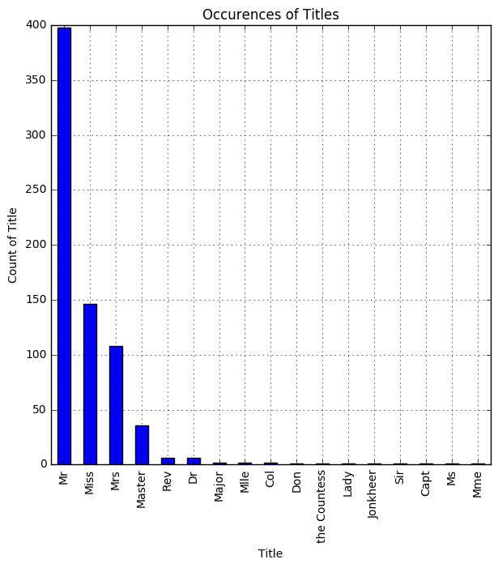
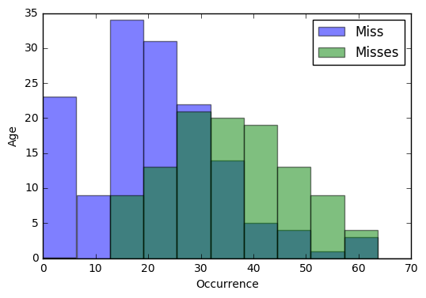
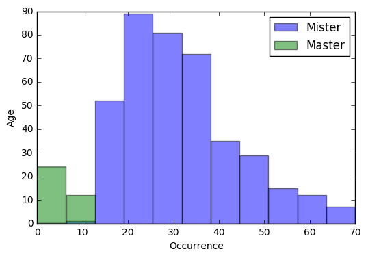
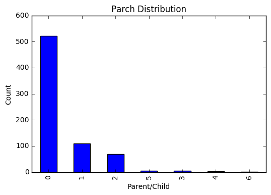
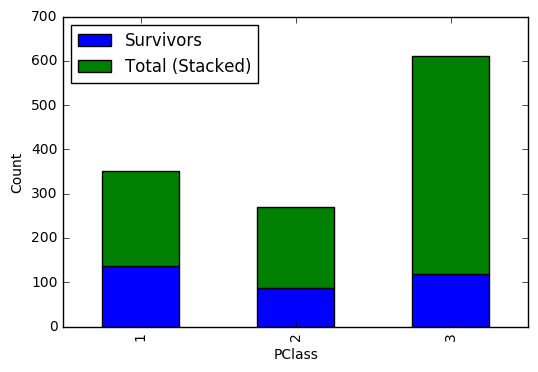

```python
import csv
import numpy as np
import os
import scipy.stats
import pandas as pd
import sqlite3 as sql
from scipy.stats import chi2_contingency
from matplotlib import pyplot
%matplotlib inline
```

# Titanic Data Analysis
## Questions to investigate:

The sinking of the Titanic was a true tragedy, leaving over 1,500 of the 2,224 passengers dead. The social status of the passengers ranged from the wealthiest people in the world to those hoping to emigrate to the United States with the promise of a better life. This diversity made the population on board the RMS Titanic was a microcosm of Western Europe in 1912. By analyzing the survival data, I am hoping to understand the effects of agem gender, and social status and the survival of the passengers.

## Loading the Data
### First I am loading the data into a Pandas Data frame.


```python
cwd = os.getcwd()
data_set = os.path.join(cwd,"titanic.db")
conn = sql.connect(data_set)
titanic = pd.read_sql("select * from titanic;", conn)
titanic.info()
```

    <class 'pandas.core.frame.DataFrame'>
    RangeIndex: 891 entries, 0 to 890
    Data columns (total 13 columns):
    index          891 non-null int64
    PassengerId    891 non-null int64
    Survived       891 non-null int64
    Pclass         891 non-null int64
    Name           891 non-null object
    Sex            891 non-null object
    Age            714 non-null float64
    SibSp          891 non-null int64
    Parch          891 non-null int64
    Ticket         891 non-null object
    Fare           891 non-null float64
    Cabin          204 non-null object
    Embarked       889 non-null object
    dtypes: float64(2), int64(6), object(5)
    memory usage: 90.6+ KB


The Age variable contains NaN. There are a number of ways to handle non numeric values for age. I could come up with methods of imputing a value for age. This could be applying the mean age to all of the records without a age value. I could also impute this value with a more sophisticated regression model. Both of these methods could bias any insights I may find. Instead I will remove these records from my dataset.


```python
titanic.dropna(subset=['Age'], inplace=True) # remove all rows from dataframe with Age value of NA
```


```python
#The mean of the Survived column gives the survival rate of the passsengers from this dataset.

titanic['Survived'].mean() 
```


    0.4061624649859944


## Investigating titles in the dataset

The dataset includes a column the with passenger's title. Titles provide insight to a passenger's social status and gender.


```python

# the format of the Name feature is Last Name, Title. Husband's Given Name (Wife's Maiden Name if applicable)
# lambda function first splits on the comma. It then takes everything from the right of the comma and splits by '.'
# the title should be to the left of the '.'
titanic['Title'] = titanic['Name'].apply(lambda x: x.split(', ')[1].partition('.')[0])
bar_chart = titanic['Title'].value_counts().plot.bar(title ="Occurences of Titles",figsize=(7,7),grid =True)
bar_chart.set(xlabel = "Title",ylabel = "Count of Title")
titanic['Title'].value_counts()

```


    Mr              398
    Miss            146
    Mrs             108
    Master           36
    Rev               6
    Dr                6
    Major             2
    Mlle              2
    Col               2
    Don               1
    the Countess      1
    Lady              1
    Jonkheer          1
    Sir               1
    Capt              1
    Ms                1
    Mme               1
    Name: Title, dtype: int64





It looks like the transformation for the new feature worked for all cases on the dataset.
There are a few oddities with the dataset. It appears that the french titles Madame (MME) and Mademoiselle (Mlle) were included. These can be easily mapped to Ms and Mrs. There are a few titles which signs of nobility ([ie the Countess and Jonkheer](https://en.wikipedia.org/wiki/Jonkheer))

There is clearly a disproportionate number of Misters vs Miss/Mrs. I will confirm that the sum of the gendered titles match the number of male and female passengers.


```python

#Checking the number of male vs female passengers to confirm that the difference in Male vs. Female titles makes sense.
Sex = titanic.groupby(by=['Sex'])['Sex'].count()
print(Sex)
# concatenating the "female titles"
Female_Titles = titanic['Title'].value_counts()['Miss']\
+titanic['Title'].value_counts()['Mrs']\
+titanic['Title'].value_counts()['Mlle']\
+titanic['Title'].value_counts()['Ms']\
+titanic['Title'].value_counts()['Jonkheer']\
+titanic['Title'].value_counts()['the Countess']\
+titanic['Title'].value_counts()['Mme']\
+titanic['Title'].value_counts()['Lady']\

print("The number of female titles: {}".format(Female_Titles))

# concatenating the "male titles"
Male_Titles = titanic['Title'].value_counts()['Mr']\
+titanic['Title'].value_counts()['Master']\
+titanic['Title'].value_counts()['Dr']\
+titanic['Title'].value_counts()['Rev']\
+titanic['Title'].value_counts()['Major']\
+titanic['Title'].value_counts()['Col']\
+titanic['Title'].value_counts()['Capt']\
+titanic['Title'].value_counts()['Sir']\
+titanic['Title'].value_counts()['Don']\

print("The number of male titles: {}".format(Male_Titles))

```

    Sex
    female    261
    male      453
    Name: Sex, dtype: int64
    The number of female titles: 261
    The number of male titles: 453


It looks like the passenger count of gender and count of gendered titles match in aggregate.

Next I will investigate how ages are distributed across 


```python
Miss = titanic.loc[titanic['Title']=='Miss']
miss_age_histogram = Miss['Age'].hist()
miss_age_histogram.set(xlabel = "Age",ylabel="Count of Age" )
```


    [<matplotlib.text.Text at 0x116d7cdd8>, <matplotlib.text.Text at 0x116d33c88>]


```python
Miss['Age'].describe()
```


    count    146.000000
    mean      21.773973
    std       12.990292
    min        0.750000
    25%       14.125000
    50%       21.000000
    75%       30.000000
    max       63.000000
    Name: Age, dtype: float64


The age of Passengers with the title Miss seems to have a large degree of variance. The median age is 21.00 with a standard deviation of 12.99. The youngest passenger with Miss in the title was 9 months old and the oldest was 63 years old.


```python
Misses = titanic.loc[titanic['Title']=='Mrs']
misses_age_histogram = Misses['Age'].hist()
misses_age_histogram.set(xlabel = "Age",ylabel="Count of Age" )
```


    [<matplotlib.text.Text at 0x117679f98>, <matplotlib.text.Text at 0x117454518>]


```python
Misses['Age'].describe()
```


    count    108.000000
    mean      35.898148
    std       11.433628
    min       14.000000
    25%       27.750000
    50%       35.000000
    75%       44.000000
    max       63.000000
    Name: Age, dtype: float64


The age of passengers with the title Miss seems to have a slightly smaller degree of variance. The median age is 35.00 with a standard deviation of 11.43. The youngest passenger with Mrs in the title was 14 months old and the oldest was 63 years old.

## Comparing Mrs to Miss


```python
bins = np.linspace(0, 70, 12)

pyplot.hist(Miss['Age'], bins, alpha=.5, label='Miss')
pyplot.hist(Misses['Age'], bins, alpha=.5, label='Misses')
pyplot.legend(loc='upper right')
pyplot.xlabel('Occurrence')
pyplot.ylabel('Age')
pyplot.show()
```





It looks like Misses is distributed more heavily towards the older population. This is reasonable, as these titles are typically related to marital status. One oddity with this data are the records where Misses is under 20 years old. I will drill into these records further


```python
Misses.where(Misses['Age']<20).dropna(subset=['Age'])
```


<div>
<table border="1" class="dataframe">
  <thead>
    <tr style="text-align: right;">
      <th></th>
      <th>index</th>
      <th>PassengerId</th>
      <th>Survived</th>
      <th>Pclass</th>
      <th>Name</th>
      <th>Sex</th>
      <th>Age</th>
      <th>SibSp</th>
      <th>Parch</th>
      <th>Ticket</th>
      <th>Fare</th>
      <th>Cabin</th>
      <th>Embarked</th>
      <th>Title</th>
    </tr>
  </thead>
  <tbody>
    <tr>
      <th>9</th>
      <td>9.0</td>
      <td>10.0</td>
      <td>1.0</td>
      <td>2.0</td>
      <td>Nasser, Mrs. Nicholas (Adele Achem)</td>
      <td>female</td>
      <td>14.0</td>
      <td>1.0</td>
      <td>0.0</td>
      <td>237736</td>
      <td>30.0708</td>
      <td>None</td>
      <td>C</td>
      <td>Mrs</td>
    </tr>
    <tr>
      <th>49</th>
      <td>49.0</td>
      <td>50.0</td>
      <td>0.0</td>
      <td>3.0</td>
      <td>Arnold-Franchi, Mrs. Josef (Josefine Franchi)</td>
      <td>female</td>
      <td>18.0</td>
      <td>1.0</td>
      <td>0.0</td>
      <td>349237</td>
      <td>17.8000</td>
      <td>None</td>
      <td>S</td>
      <td>Mrs</td>
    </tr>
    <tr>
      <th>291</th>
      <td>291.0</td>
      <td>292.0</td>
      <td>1.0</td>
      <td>1.0</td>
      <td>Bishop, Mrs. Dickinson H (Helen Walton)</td>
      <td>female</td>
      <td>19.0</td>
      <td>1.0</td>
      <td>0.0</td>
      <td>11967</td>
      <td>91.0792</td>
      <td>B49</td>
      <td>C</td>
      <td>Mrs</td>
    </tr>
    <tr>
      <th>307</th>
      <td>307.0</td>
      <td>308.0</td>
      <td>1.0</td>
      <td>1.0</td>
      <td>Penasco y Castellana, Mrs. Victor de Satode (M...</td>
      <td>female</td>
      <td>17.0</td>
      <td>1.0</td>
      <td>0.0</td>
      <td>PC 17758</td>
      <td>108.9000</td>
      <td>C65</td>
      <td>C</td>
      <td>Mrs</td>
    </tr>
    <tr>
      <th>546</th>
      <td>546.0</td>
      <td>547.0</td>
      <td>1.0</td>
      <td>2.0</td>
      <td>Beane, Mrs. Edward (Ethel Clarke)</td>
      <td>female</td>
      <td>19.0</td>
      <td>1.0</td>
      <td>0.0</td>
      <td>2908</td>
      <td>26.0000</td>
      <td>None</td>
      <td>S</td>
      <td>Mrs</td>
    </tr>
    <tr>
      <th>700</th>
      <td>700.0</td>
      <td>701.0</td>
      <td>1.0</td>
      <td>1.0</td>
      <td>Astor, Mrs. John Jacob (Madeleine Talmadge Force)</td>
      <td>female</td>
      <td>18.0</td>
      <td>1.0</td>
      <td>0.0</td>
      <td>PC 17757</td>
      <td>227.5250</td>
      <td>C62 C64</td>
      <td>C</td>
      <td>Mrs</td>
    </tr>
    <tr>
      <th>781</th>
      <td>781.0</td>
      <td>782.0</td>
      <td>1.0</td>
      <td>1.0</td>
      <td>Dick, Mrs. Albert Adrian (Vera Gillespie)</td>
      <td>female</td>
      <td>17.0</td>
      <td>1.0</td>
      <td>0.0</td>
      <td>17474</td>
      <td>57.0000</td>
      <td>B20</td>
      <td>S</td>
      <td>Mrs</td>
    </tr>
    <tr>
      <th>830</th>
      <td>830.0</td>
      <td>831.0</td>
      <td>1.0</td>
      <td>3.0</td>
      <td>Yasbeck, Mrs. Antoni (Selini Alexander)</td>
      <td>female</td>
      <td>15.0</td>
      <td>1.0</td>
      <td>0.0</td>
      <td>2659</td>
      <td>14.4542</td>
      <td>None</td>
      <td>C</td>
      <td>Mrs</td>
    </tr>
    <tr>
      <th>855</th>
      <td>855.0</td>
      <td>856.0</td>
      <td>1.0</td>
      <td>3.0</td>
      <td>Aks, Mrs. Sam (Leah Rosen)</td>
      <td>female</td>
      <td>18.0</td>
      <td>0.0</td>
      <td>1.0</td>
      <td>392091</td>
      <td>9.3500</td>
      <td>None</td>
      <td>S</td>
      <td>Mrs</td>
    </tr>
  </tbody>
</table>
</div>


Fro the name field, each female with a title of Mrs also has their husband's name. Although this would be highly atypical in 2017, it is not outside of the realm of possiblity in 1912.


```python
Mister = titanic.loc[titanic['Title']=='Mr']
mister_age_histogram = Mister['Age'].hist()
mister_age_histogram.set(xlabel = "Age",ylabel="Count of Age" )
```


    [<matplotlib.text.Text at 0x117aaa978>, <matplotlib.text.Text at 0x117a712e8>]


```python
Master = titanic.loc[titanic['Title']=='Master']
master_age_histogram = Master['Age'].hist()
master_age_histogram.set(xlabel = "Age",ylabel="Count of Age" )
```


    [<matplotlib.text.Text at 0x117e21c50>, <matplotlib.text.Text at 0x117aa78d0>]


```python
bins = np.linspace(0, 70, 12)

pyplot.hist(Mister['Age'], bins, alpha=.5, label='Mister')
pyplot.hist(Master['Age'], bins, alpha=.5, label='Master')
pyplot.xlabel('Occurrence')
pyplot.ylabel('Age')
pyplot.legend(loc='upper right')
pyplot.show()
```





A large proportion of those with the Mister title are under 20 years old. Although there was a clear delination between married and unmarried female passengers (i.e. parenthesis in the name of the passenger) there are no obvious indicators of marriage for male passengers.


```python
"""
The query below will match passengers where their first and last name's match.
The data that we are currently looking at is a sample of the titanic data, and therefore
nothing can be deduced from the results of this query. With a more complete dataset, this query
could help with analysis.
"""

pd.read_sql("""
    select 
        *
    From
        (
            select
                substr(Name, 0, instr(Name,',')) as NamePartOne,
                substr(Name, instr(Name,'.')+1, length(Name)) as NamePartTwo,
                SibSp,
                Parch,
                Name
            from titanic
            where 
                name LIKE "%Mr.%"
        ) as Mister
    JOIN
        (
            select
                substr(Name, 0, instr(Name,',')) as NamePartOne,
                substr(Name, instr(Name,'.')+1, length(Name)) as NamePartTwo,
                SibSp,
                Parch,
                Name
            from titanic
            where 
                name LIKE "%Mrs.%"
        ) as Misses
        ON Misses.NamePartOne = Mister.NamePartOne
            and Misses.NamePartTwo = Mister.NamePartTwo+"%"
    """, conn)
```


<div>
<table border="1" class="dataframe">
  <thead>
    <tr style="text-align: right;">
      <th></th>
      <th>NamePartOne</th>
      <th>NamePartTwo</th>
      <th>SibSp</th>
      <th>Parch</th>
      <th>Name</th>
      <th>NamePartOne</th>
      <th>NamePartTwo</th>
      <th>SibSp</th>
      <th>Parch</th>
      <th>Name</th>
    </tr>
  </thead>
  <tbody>
  </tbody>
</table>
</div>


```python
#titanic['SibSp'].value_counts().plot(kind ="bar", title ="Sibling/Spouse Distribution")
plot = titanic[['SibSp','Survived']].groupby("SibSp")['Survived'].agg(np.mean).plot(kind ="bar")
plot.set_ylabel('Survival %')
```


    <matplotlib.text.Text at 0x118230a20>


## Formal Hypothesis testing

Now I will do some formal analysis of the features in the dataset.


```python
plot = titanic['Parch'].value_counts().plot(kind ="bar", title ="Parch Distribution")
plot.set_xlabel('Parent/Child')
plot.set_ylabel('Count')
```


    <matplotlib.text.Text at 0x118212198>





## Looking at the questions which I hope to answer, I see some of the relevant features of the data set are Age, Sex, and Pclass.

### I will test if there is a significant differents between the survival of males vs the survival of females in the titanic. Formally my hypthosis will be as follows

H<sub>0</sub>: Survival and gender are independent.

H<sub>1</sub>: Survival and gender are not independent.


```python
genderDF = pd.read_sql("""
    select
        Sex,
        sum(Survived) as Survivors,
        count(Survived) as "Total (Stacked)"
    from titanic
    group by Sex;
    """, conn)


ax = genderDF.plot(kind="bar", stacked= True)
ax.set_xticklabels(genderDF.Sex)
ax.set_xlabel('Gender')
ax.set_ylabel('Count')
```


    <matplotlib.text.Text at 0x117e0afd0>


This graph shows that, while there were fewer females than males, a greater number of females survived than males. I will investigate whether this difference is statistically significant below.


```python
pivot = pd.pivot_table(data = titanic[['Survived', 'Sex']], index = 'Survived', columns = ['Sex'], aggfunc = len)
print(pivot)
chi2, p_value, dof, expected = chi2_contingency(pivot)
print("Results of Chi-Squared test on Pclass to Survival.")
print("Does gender have a significant effect on Survival?")
print("Chi-Squared Score = " + str(chi2))
print("Pvalue = " + str(p_value))
print("\n")
```

    Sex       female  male
    Survived              
    0             64   360
    1            197    93
    Results of Chi-Squared test on Pclass to Survival.
    Does gender have a significant effect on Survival?
    Chi-Squared Score = 205.025827529
    Pvalue = 1.67166784414e-46
    
    


At the 99% confidence level, I must reject H<sub>0</sub> and Accept H<sub>a</sub> that survival and gender are not independent.

### I will test if there is a significant differents between the upper class and other passengers. Formally my hypthosis will be as follows

H<sub>0</sub>: Pclass and Surival rates are independent.

H<sub>1</sub>: Pclass and Survival rates are not independent.


```python
PclassDF = pd.read_sql("""
    select
        Pclass,
        sum(Survived) as Survivors,
        count(Survived) as "Total (Stacked)"
    from titanic
    group by Pclass;
    """, conn)


ax = PclassDF[['Survivors', 'Total (Stacked)']].plot(kind="bar", stacked= True)
ax.set_xticklabels(PclassDF.Pclass)
ax.set_xlabel('PClass')
ax.set_ylabel('Count')
```


    <matplotlib.text.Text at 0x1182172b0>





While third class passengers(which is a proxy for the patient's social standing) have a far greater total than 2nd or 1st class passengers, the number of survivors is roughly the same. I will test if this difference is statistically significant.


```python
lower_class = pd.read_sql("""
    select
        Survived
    from titanic
    where 
        Pclass = 3;
    """, conn)
middle_class = pd.read_sql("""
    select
        Survived
    from titanic
    where 
        Pclass = 2;
    """, conn)
upper_class = pd.read_sql("""
    select
        Survived
    from titanic
    where 
        Pclass = 1;
    """, conn)
print(upper_class.describe())
print(middle_class.describe())
print(lower_class.describe())

```

             Survived
    count  216.000000
    mean     0.629630
    std      0.484026
    min      0.000000
    25%      0.000000
    50%      1.000000
    75%      1.000000
    max      1.000000
             Survived
    count  184.000000
    mean     0.472826
    std      0.500623
    min      0.000000
    25%      0.000000
    50%      0.000000
    75%      1.000000
    max      1.000000
             Survived
    count  491.000000
    mean     0.242363
    std      0.428949
    min      0.000000
    25%      0.000000
    50%      0.000000
    75%      0.000000
    max      1.000000


```python
pivot = pd.pivot_table(data = titanic[['Survived', 'Pclass']], index = 'Survived', columns = ['Pclass'], aggfunc = len)
print(pivot,"\n")


chi2, p_value, dof, expected = chi2_contingency(pivot)
print("Results of Chi-Squared test on Pclass to Survival.")
print("Does Pclass have a significant effect on Survival?")
print("Chi-Squared Score = " + str(chi2))
print("Pvalue = " + str(p_value))
print("\n")
```

    Pclass      1   2    3
    Survived              
    0          64  90  270
    1         122  83   85 
    
    Results of Chi-Squared test on Pclass to Survival.
    Does Pclass have a significant effect on Survival?
    Chi-Squared Score = 92.9014172114
    Pvalue = 6.70986174976e-21
    
    


At the 99% confidence level, I must reject H<sub>0</sub> and Accept H<sub>a</sub> that there is a statistically significant difference in survival rates


```python
AgeDF = pd.read_sql("""
    select
        Age,
        Survived
    from titanic
    group by Age;
    """, conn)


ax = AgeDF.plot(kind="scatter", x="Age", y="Survived", yticks=[0,1])

```


It appears that the age of the surviving passengers are skewed towards the younger half. I will test to see if there is a statistical difference.
### I will test if there is a significant differents between the survival of children vs adults.  I do not want to compare the mean age, but rather compare the ages in groups. Therefore, I will stratify ages in ten year increments. Formally my hypthosis will be as follows

H<sub>0</sub>: Age and survival are independent.

H<sub>1</sub>: Age and survival are not independent.


```python
titanic['Rounded_Age']=titanic['Age'].apply(lambda x : round(x,-1))
print(titanic[['Survived','Rounded_Age','Age']].groupby('Rounded_Age')['Survived'].count())

pivot = pd.pivot_table(data = titanic[['Survived', 'Rounded_Age']], index = 'Survived', columns = ['Rounded_Age'], aggfunc = len, fill_value=0)
print(pivot,"\n")


chi2, p_value, dof, expected = chi2_contingency(pivot)
print("Results of Chi-Squared test on Age to Survival.")
print("Does Age have a significant effect on Survival?")
print("Chi-Squared Score = " + str(chi2))
print("Pvalue = " + str(p_value))
print("\n")
```

    Rounded_Age
    0.0      44
    10.0     34
    20.0    223
    30.0    178
    40.0    132
    50.0     61
    60.0     34
    70.0      7
    80.0      1
    Name: Survived, dtype: int64
    Rounded_Age  0.0   10.0  20.0  30.0  40.0  50.0  60.0  70.0  80.0
    Survived                                                         
    0              13    20   144   106    76    36    22     7     0
    1              31    14    79    72    56    25    12     0     1 
    
    Results of Chi-Squared test on Age to Survival.
    Does Age have a significant effect on Survival?
    Chi-Squared Score = 25.5702920151
    Pvalue = 0.0012436364166
    
    


At the 99% confidence level, I must reject H<sub>0</sub> and Accept H<sub>a</sub> that survival and age are not independent.

# Conclusion.

In conclusion, I have found that age, gender, and class all seemed to have a statistically significant relationship with the survival rate of passengers on the titanic.

It is important to note that the dataset had values for age missing. Records without age were removed from the dataset.

Further I have explored some of the intricacies of titles in 1912 and have a greater sense of the underlying data.
